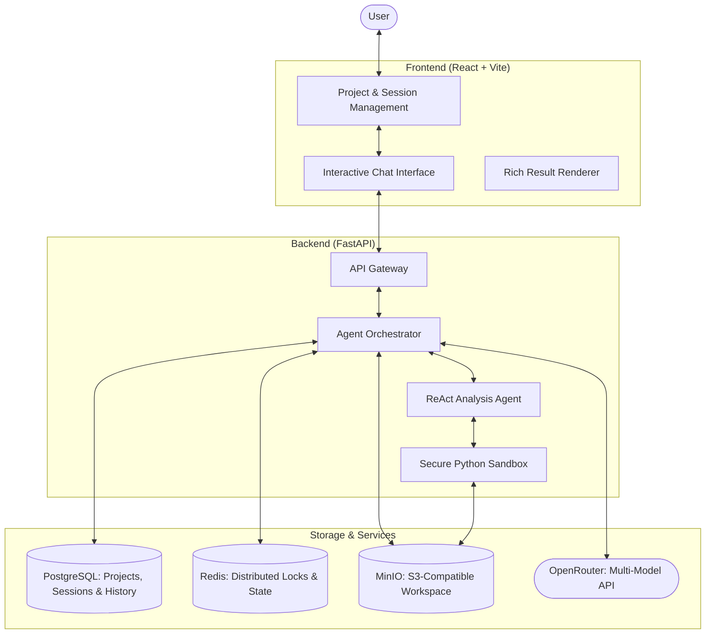
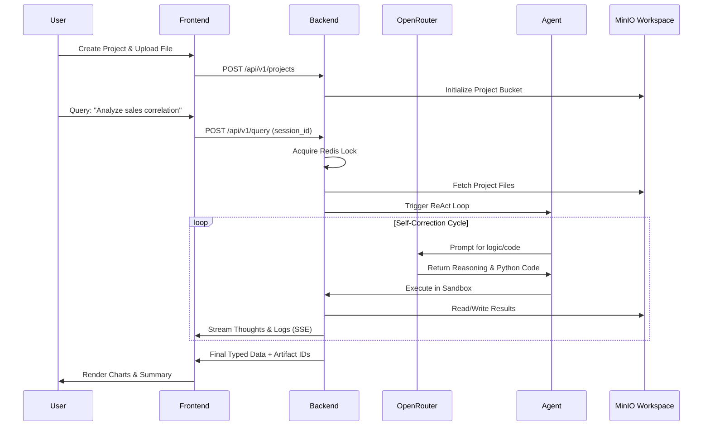

# CodingAgent: AI-Powered Data Analysis & Coding Assistant

[](https://www.python.org/downloads/)
[](https://fastapi.tiangolo.com/)
[](https://reactjs.org/)
[](https://opensource.org/licenses/MIT)

**CodingAgent** is a stateful, AI-driven platform for automated data analysis and visualization. It leverages frontier LLMs and a secure Python execution environment to transform natural language queries into executable code and interactive insights.

---

## Architecture Overview

The system features a project-centric, event-driven architecture designed for scalability and state persistence.



## Key Features

- **Project-Based Organization**: Group multiple analysis sessions under unified projects with shared datasets and persistent state.
- **Natural Language Data Analysis**: Convert English queries into complex data processing, filtering, and aggregation using pandas.
- **Multi-Model Support via OpenRouter**: Seamless access to frontier models including GPT-4o, Claude 3.5 Sonnet, Gemini 3 Pro, and DeepSeek V3.
- **Secure Code Execution**: Isolated sandbox for running AI-generated Python code using sophisticated safety boundaries and authorized imports.
- **Stateful Intelligence**: Persistent context across interactions, including file history, previous results, and agent "thought" logs.
- **Dynamic Artifacts**: Real-time rendering of interactive Plotly charts, data tables (pandas), and execution logs.
- **Automated Self-Correction**: The agent identifies execution errors and automatically refines code to achieve the requested goal.

## Tech Stack

| Layer | Technologies |
| --- | --- |
| **Frontend** | React 19, Vite, Tailwind CSS (v4), Shadcn UI, Lucide |
| **Backend** | FastAPI, Pydantic, LiteLLM, LangChain |
| **Agent Core** | smolagents, Custom Python Executors |
| **Storage** | PostgreSQL (Relational), Redis (Cache), MinIO (Object Storage) |
| **Build Tools** | **uv** (Python), **pnpm** (Node.js) |
| **AI Gateway** | **OpenRouter** (Unified LLM access) |

## Project Structure

```text
.
├── backend/                # FastAPI Application
│   ├── app/
│   │   ├── agents/         # ReAct logic & specialized analysis agents
│   │   ├── api/routes/     # API Endpoints (Projects, Sessions, Query, etc.)
│   │   ├── core/           # Core infrastructure (Storage providers, locks)
│   │   ├── db/             # Repository layer & Database connectivity
│   │   ├── prompts/        # Jinja2 templates for LLM instruction sets
│   │   ├── services/       # Business logic: Orchestration & Session state
│   │   ├── shared/         # Common models, LLM bridge & Logging
│   │   └── config.py       # Pydantic Settings & environment config
│   └── main.py             # Server entry point
├── frontend/               # React + Vite Application
│   ├── src/
│   │   ├── api/            # API client definitions (Axios)
│   │   ├── components/     # UI: Chat components, Artifact renderers, Sidebars
│   │   ├── hooks/          # Custom hooks for state & API consumption
│   │   ├── stores/         # Application state management
│   │   └── types/          # TypeScript interface & enum definitions
│   └── package.json
├── docker-compose.yml      # App services container orchestration
├── docker-compose.infra.yml # External dependencies (Postgres, Redis, MinIO)
└── Makefile                # Shortcuts for setup, testing, and linting
```

## Execution Flow

The following sequence illustrates a typical data analysis cycle within a project context.



## Installation & Setup

### 1. Infrastructure
Ensure Docker is installed and run:
```bash
docker-compose up -d
```

### 2. Backend (using uv)
```bash
cd backend
uv sync
# Add OPENROUTER_API_KEY to .env
python main.py
```

### 3. Frontend (using pnpm)
```bash
cd frontend
pnpm install
pnpm dev
```
