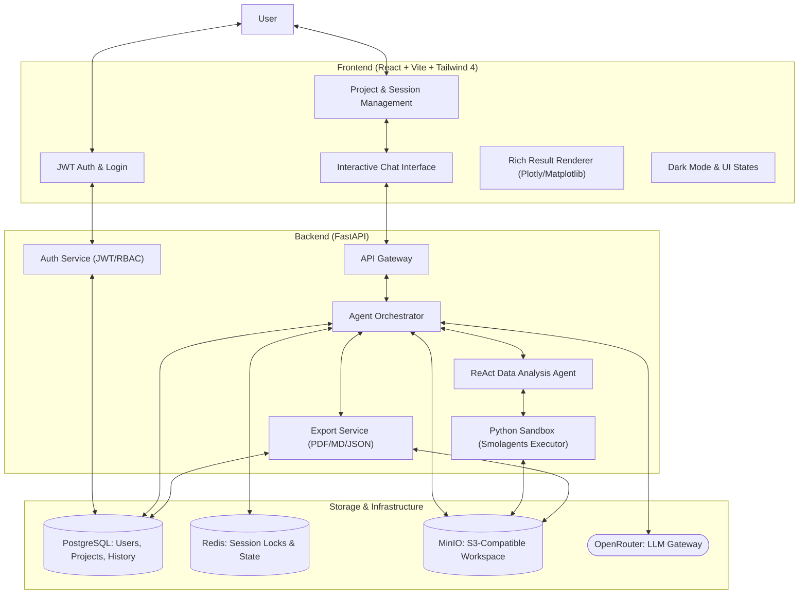
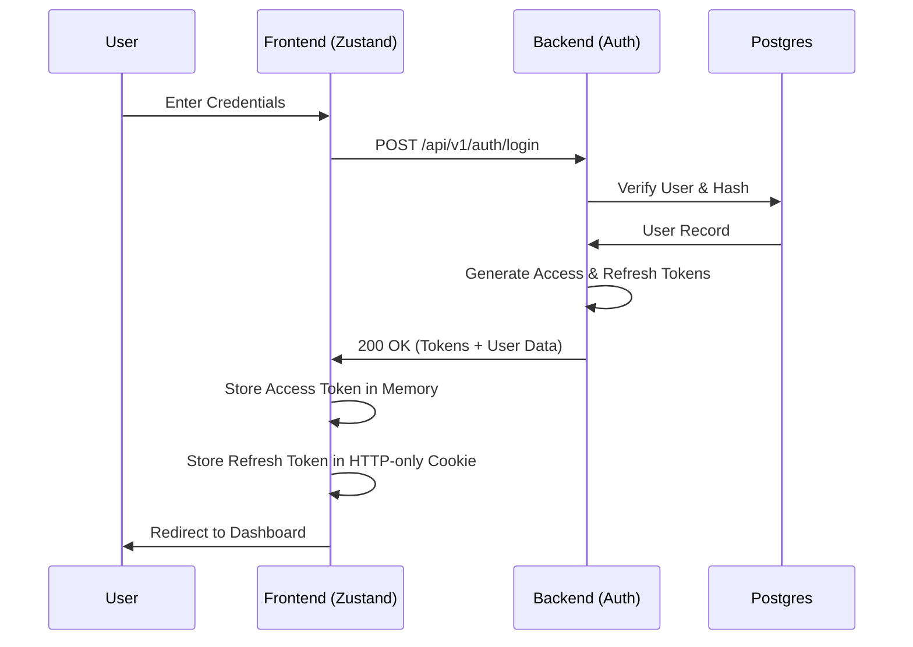
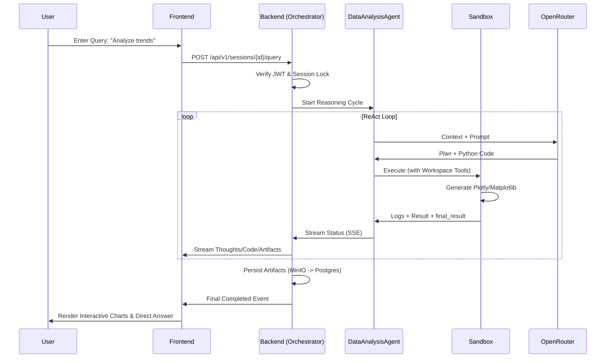

# CodingAgent

CodingAgent is a sophisticated AI-driven platform for automated data analysis and visualization. It enables users to transform natural language queries into executable Python code, run it in a secure sandbox, and view interactive artifacts in real-time with built-in authentication and session management.

[](#)
[](https://www.python.org/)
[](https://reactjs.org/)
[](LICENSE)
[](#)

---

## Architecture Overview

The system architecture is designed for scalability, security, and multi-user support, utilizes a multi-layered approach to handle complex data analysis tasks while maintaining strict isolation.



## Key Features

- **Secure Authentication & RBAC**: Advanced JWT-based authentication system with refresh token rotation and Role-Based Access Control (Admin/User).
- **Project-Centric Workflow**: Organize analysis sessions into projects with shared datasets, persistent state, and group-level artifacts.
- **Natural Language to Code**: Converts text queries into optimized Python code using `pandas`, `numpy`, and professional visualization libraries.
- **Enhanced Reasoning & Direct Answers**: The agent utilizes a `final_result` variable to provide concise, direct answers alongside its full reasoning path.
- **Session & Project Export**: Export entire sessions or projects into structured Markdown, JSON, or high-quality PDF formats with embedded visuals.
- **Multimodal LLM Support**: Leverage frontier models like Claude 4.5, GPT-5.2, and Gemini 3 Pro via OpenRouter.
- **Interactive Visualizations**: Real-time rendering of `Plotly` graphs, `Matplotlib` charts, and interactive tables with auto-formatting.
- **Dark Mode & Modern UI**: Sleek, responsive interface built with Tailwind CSS v4 and Shadcn UI, featuring full dark mode support and micro-animations.
- **Secure Code Sandbox**: Executes AI-generated code in an isolated environment with restricted imports and resource limits.
- **Automated Debugging**: The agent self-corrects by analyzing execution logs and refining its logic on failure.

## Tech Stack

| Component | Technologies |
| --- | --- |
| **Frontend** | React 19, Vite, Tailwind CSS v4, Lucide Icons, Shadcn UI |
| **Backend** | FastAPI, Pydantic v2, LiteLLM, smolagents, SQLAlchemy |
| **Authentication** | JWT (PyJWT), Passlib (Bcrypt), OAuth2 Password Flow |
| **Data Analysis** | Pandas, Numpy, Plotly, Matplotlib, Seaborn, Scikit-learn, Kaleido |
| **Database** | PostgreSQL 16, Redis (Caching and Session Locking) |
| **Storage** | MinIO (Object Storage for artifacts and workspaces) |
| **Package Management** | `uv` (Python), `pnpm` (Node.js) |

## Project Structure

```text
.
├── backend/                # Backend API and Agent Logic
│   ├── app/
│   │   ├── agents/         # ReAct agent implementations & executors
│   │   ├── api/routes/     # RESTful API (Query, Auth, Sessions, Projects)
│   │   ├── core/           # Infrastructure & Security (Auth, Deps)
│   │   ├── db/             # Persistence layer & Repositories
│   │   ├── prompts/        # LLM instruction templates (Jinja2)
│   │   ├── services/       # Business logic (Export, Orchestration)
│   │   └── config.py       # Application settings & environment
│   └── main.py             # FastAPI entry point
├── frontend/               # React Application
│   ├── src/
│   │   ├── api/            # API client (Axios with Auth Interceptors)
│   │   ├── components/     # UI Components (Chat, Auth, Sidebar, Export)
│   │   ├── hooks/          # React hooks for state and side effects
│   │   ├── stores/         # Global state management (Zustand)
│   │   └── types/          # TypeScript interface definitions
│   └── vite.config.ts      # Vite build configuration
├── docker-compose.yml      # Service orchestration (App + Workers)
├── docker-compose.infra.yml # Infrastructure (Postgres, Redis, MinIO)
└── Makefile                # Development and deployment shortcuts
```

## Logic Flows

### 1. Authentication Lifecycle


### 2. Query Execution & Artifact Capture


## Installation & Setup

### Quick Start (using Makefile)

The project includes a `Makefile` to simplify development and infrastructure management.

- **Infrastructure**: `make up` (starts PostgreSQL, Redis, MinIO) / `make down` (stops them).
- **Full Setup**: `make setup` (installs backend and frontend dependencies).
- **Development**: `make start` (starts infrastructure and both dev servers).
- **Cleanup**: `make stop` (stops all services and containers).

### Manual Installation

#### 1. Infrastructure
```bash
docker-compose -f docker-compose.infra.yml up -d
```

#### 2. Backend Setup
1. Navigate to the backend directory: `cd backend`
2. Install dependencies: `uv sync`
3. Configure Environment: Create `.env` with:
   - `OPENROUTER_API_KEY`
   - `DATABASE_URL` (Postgres)
   - `SECRET_KEY` (for JWT)
4. Run the server: `python main.py`

#### 3. Frontend Setup
1. Navigate to the frontend directory: `cd frontend`
2. Install dependencies: `pnpm install`
3. Start the dev server: `pnpm dev`

## Usage Examples

### Login API Example
```bash
curl -X POST http://localhost:8000/api/v1/auth/login \
  -H "Content-Type: application/json" \
  -d '{
    "email": "user@example.com",
    "password": "securepassword"
  }'
```

### Export Session Example
```bash
curl -X GET http://localhost:8000/api/v1/sessions/{session_id}/export \
  -H "Authorization: Bearer {access_token}" \
  -o session_export.md
```

### Keyboard Shortcuts
| Shortcut | Action |
| --- | --- |
| `Ctrl/Cmd + B` | Toggle Project Sidebar |
| `Ctrl/Cmd + Shift + B` | Toggle Artifacts Sidebar |
| `Ctrl/Cmd + J` | Create New Session |
| `Ctrl/Cmd + Shift + L` | Toggle Dark/Light Mode |
| `/` | Focus Chat Input |
