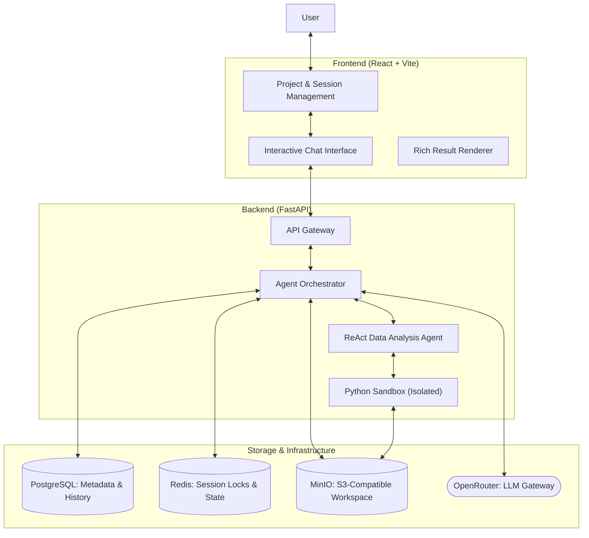
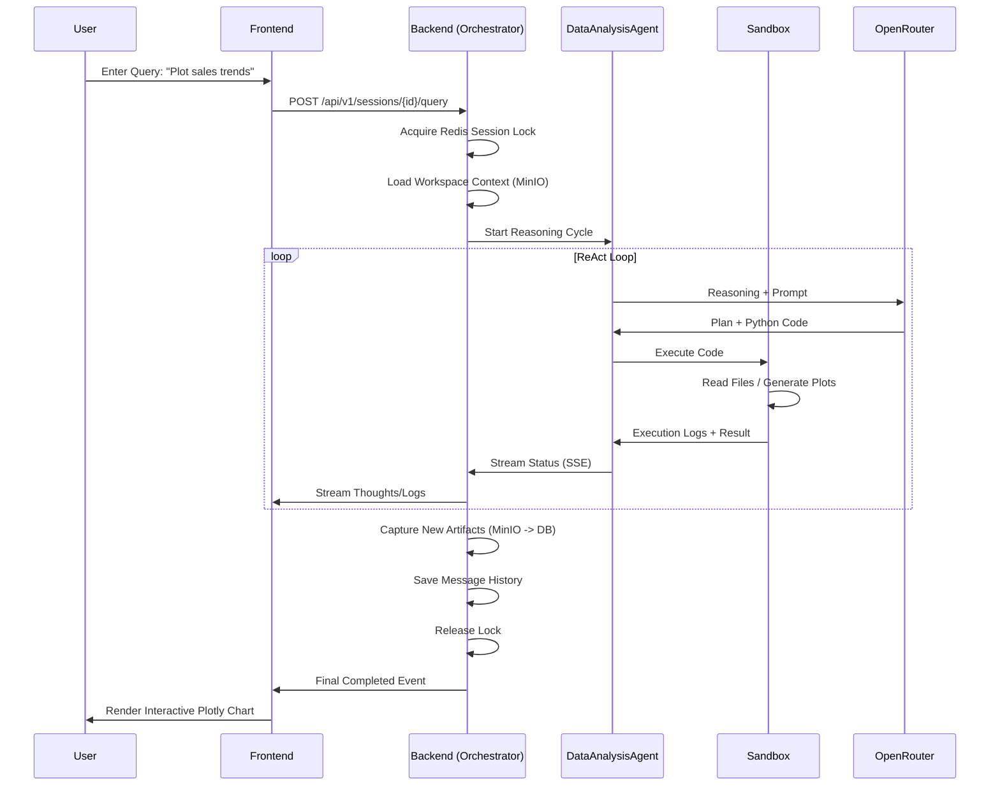

# CodingAgent

**CodingAgent** is a stateful, AI-driven platform for automated data analysis and visualization. It transforms natural language queries into executable Python code, runs it in a secure sandbox, and renders interactive artifacts (charts, tables) in real-time.

---

## Architecture Overview

The system follows a project-centric, event-driven architecture designed for high throughput and persistent state management.



## Key Features

- **Project-Based Organization**: Group multiple analysis sessions under unified projects with shared datasets and persistent state.
- **Natural Language Data Analysis**: Convert natural language queries into complex data processing, filtering, and aggregation using `pandas` and `numpy`.
- **Multi-Model Support**: Seamless access to frontier models (GPT-5.2, Claude 4.5 Sonnet, Gemini 3 Pro) via a unified OpenRouter interface.
- **Secure Code Execution**: Isolated sandbox for running AI-generated code with strict authorized imports and safety boundaries.
- **Real-Time Artifact Rendering**: Dynamic streaming and rendering of interactive `Plotly` charts, `pandas` tables, and execution logs.
- **Automated Self-Correction**: The agent detects code execution errors and automatically refines the logic to achieve the user's goal.
- **Stateful Intelligence**: Persistent context across interactions, including file history, previous reasoning, and agent "thought" logs.

## Tech Stack

| Component | Technologies |
| --- | --- |
| **Frontend** | React 19, Vite, Tailwind CSS v4, Shadcn UI, Lucide |
| **Backend** | FastAPI, Pydantic, LiteLLM, smolagents |
| **Data Science** | Pandas, Numpy, Plotly, Matplotlib, Scikit-learn |
| **Database** | PostgreSQL 16 (Relational), Redis (Caching/Locking) |
| **Storage** | MinIO (S3-Compatible Object Storage) |
| **Tooling** | **uv** (Python Package Manager), **pnpm** (Node.js Package Manager) |

## Project Structure

```text
.
├── backend/                # FastAPI Application
│   ├── app/
│   │   ├── agents/         # ReAct logic & specialized analysis agents
│   │   ├── api/routes/     # REST Endpoints (Projects, Sessions, Query)
│   │   ├── core/           # Core infrastructure (Storage, Cache, Security)
│   │   ├── db/             # Repository layer & Database connectivity
│   │   ├── prompts/        # Jinja2 templates for LLM instruction sets
│   │   ├── services/       # Orchestration & Business logic
│   │   └── config.py       # Pydantic Settings & environment config
│   └── main.py             # Server entry point
├── frontend/               # React + Vite Application
│   ├── src/
│   │   ├── api/            # API client definitions (Axios)
│   │   ├── components/     # UI: Chat components, Artifact renderers, Sidebars
│   │   ├── hooks/          # Custom hooks for state & API consumption
│   │   ├── stores/         # Global state management
│   │   └── types/          # TypeScript definitions
│   └── package.json
├── docker-compose.yml      # Service orchestration
├── docker-compose.infra.yml # External dependencies (Postgres, Redis, MinIO)
└── Makefile                # Shortcuts for setup and development
```

## Logic Flows

The following sequence highlights the lifecycle of a query, from user input to rich artifact rendering.



## Installation & Setup

### Quick Start (using Makefile)
The project includes a `Makefile` to simplify development and infrastructure management.

- **Infrastructure**: `make up` (starts Postgres, Redis, MinIO) / `make down` (stops them).
- **Full Setup**: `make setup` (installs backend and frontend dependencies).
- **Full Start**: `make start` (starts infrastructure and both service servers).
- **Full Stop**: `make stop` (kills all running processes and infrastructure).

### Manual Installation

#### 1. Infrastructure
Ensure Docker is installed and run:
```bash
docker-compose -f docker-compose.infra.yml up -d
```

#### 2. Backend Setup (using uv)
```bash
cd backend
uv sync
# Configure .env with OPENROUTER_API_KEY
python main.py
```

#### 3. Frontend Setup (using pnpm)
```bash
cd frontend
pnpm install
pnpm dev
```
