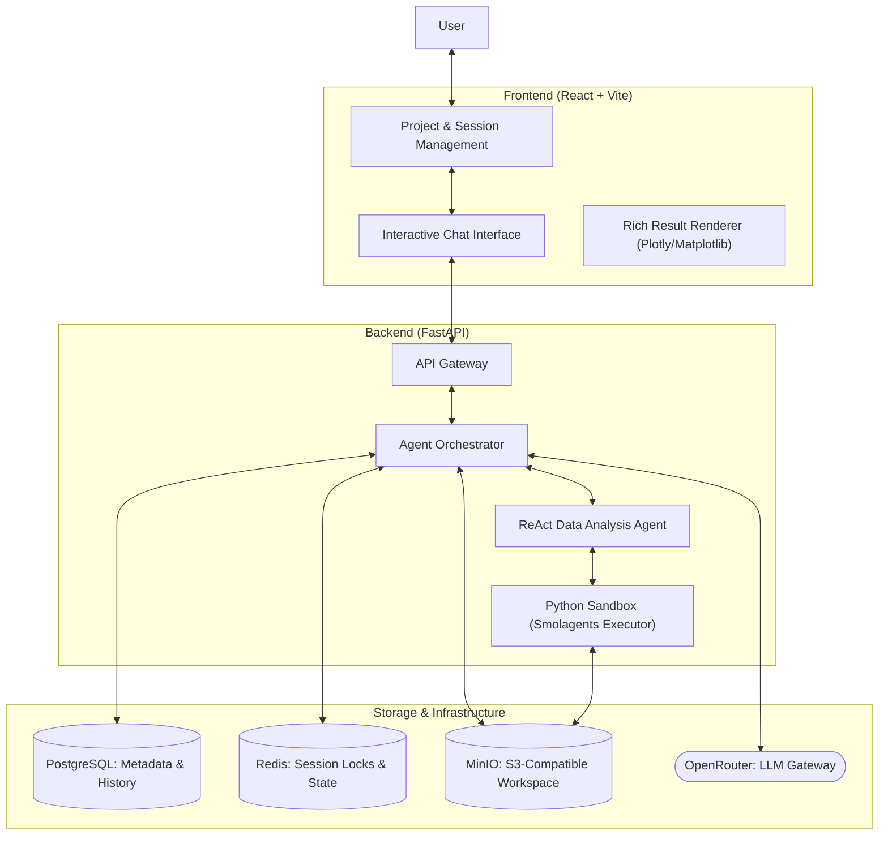
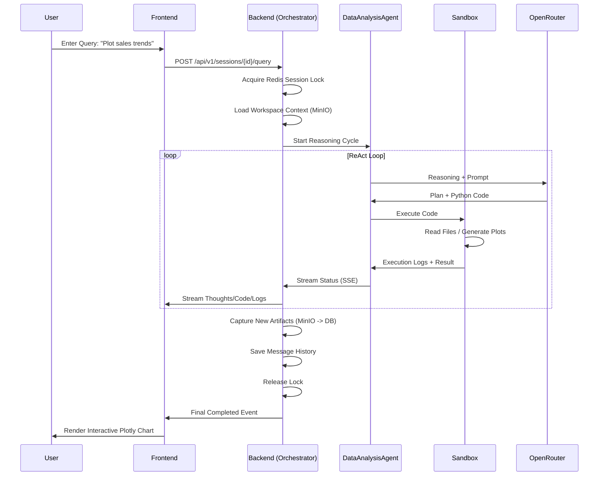

# CodingAgent

CodingAgent is a sophisticated AI-driven platform for automated data analysis and visualization. It enables users to transform natural language queries into executable Python code, run it in a secure sandbox, and view interactive artifacts in real-time.

[](#)
[](https://www.python.org/)
[](https://reactjs.org/)
[](LICENSE)

---

## Architecture Overview

The system architecture is designed for scalability and security, utilizing a multi-layered approach to handle complex data analysis tasks.



## Key Features

- **Project-Centric Workflow**: Organize analysis sessions into projects with shared datasets and persistent state.
- **Natural Language to Code**: Converts text queries into optimized Python code using `pandas`, `numpy`, and visualization libraries.
- **Multimodal LLM Support**: Leverage frontier models like Claude 3.5, GPT-4o, and Gemini 1.5 Pro via OpenRouter.
- **Interactive Visualizations**: Real-time rendering of `Plotly` graphs, `Matplotlib` charts, and interactive tables.
- **Secure Code Sandbox**: Executes AI-generated code in an isolated environment with restricted imports and safety checks.
- **Stateful Sessions**: Maintains conversation history and workspace state across multiple interactions.
- **Automated Debugging**: The agent can self-correct by analyzing execution logs and refining its code on failure.
- **Human In Loop**: The agent can request user input to clarify its reasoning or to refine its code.

## Tech Stack

| Component | Technologies |
| --- | --- |
| **Frontend** | React 19, Vite, Tailwind CSS v4, Shadcn UI, Lucide Icons |
| **Backend** | FastAPI, Pydantic v2, LiteLLM, smolagents |
| **Data Analysis** | Pandas, Numpy, Plotly, Matplotlib, Seaborn, Scikit-learn |
| **Database** | PostgreSQL 16, Redis (Caching and Session Locking) |
| **Storage** | MinIO (Object Storage for artifacts and workspaces) |
| **Package Management** | `uv` (Python), `pnpm` (Node.js) |

## Project Structure

```text
.
├── backend/                # Backend API and Agent Logic
│   ├── app/
│   │   ├── agents/         # ReAct agent implementations & executors
│   │   ├── api/routes/     # RESTful API endpoints (Query, Sessions, Projects)
│   │   ├── core/           # Infrastructure services (Cache, Storage)
│   │   ├── db/             # Persistence layer & Repositories
│   │   ├── prompts/        # LLM instruction templates (Jinja2)
│   │   ├── services/       # Business logic & Orchestration
│   │   └── config.py       # Application settings & environment configuration
│   └── main.py             # FastAPI entry point
├── frontend/               # React Application
│   ├── src/
│   │   ├── api/            # API client (Axios-based)
│   │   ├── components/     # UI Components (Chat, Sidebar, Artifacts)
│   │   ├── hooks/          # React hooks for state and side effects
│   │   ├── stores/         # Global state management
│   │   └── types/          # TypeScript interface definitions
│   └── vite.config.ts      # Vite build configuration
├── docker-compose.yml      # Service orchestration (Backend + Frontend)
├── docker-compose.infra.yml # Infrastructure services (Postgres, Redis, MinIO)
└── Makefile                # Development and deployment shortcuts
```

## Logic Flows

The following sequence highlights the lifecycle of a query, from user input to rich artifact rendering.



## Installation & Setup

### Quick Start (using Makefile)

The project includes a `Makefile` to simplify development and infrastructure management.

- **Infrastructure**: `make up` (starts PostgreSQL, Redis, MinIO) / `make down` (stops them).
- **Full Setup**: `make setup` (installs backend and frontend dependencies).
- **Start All**: `make start` (starts infrastructure and both service servers).
- **Stop All**: `make stop` (stops all services and infrastructure).

### Manual Installation

#### 1. Infrastructure
Run the infrastructure services using Docker:
```bash
docker-compose -f docker-compose.infra.yml up -d
```

#### 2. Backend Setup
1. Navigate to the backend directory: `cd backend`
2. Install dependencies using `uv`: `uv sync`
3. Configure your environment: Create a `.env` file with `OPENROUTER_API_KEY`.
4. Run the server: `python main.py`

#### 3. Frontend Setup
1. Navigate to the frontend directory: `cd frontend`
2. Install dependencies using `pnpm`: `pnpm install`
3. Start the development server: `pnpm dev`

## Usage Examples

### API Query Example

To initiate a coding task via the API:

```bash
curl -X POST http://localhost:8000/api/v1/sessions/{session_id}/query \
  -H "Content-Type: application/json" \
  -d '{
    "query": "Analyze the sales data in sales.csv and plot monthly revenue.",
    "file_ids": ["uuid-of-sales-csv"],
    "model": "openrouter/anthropic/claude-3.5-sonnet"
  }'
```

The response will be a Server-Sent Events (SSE) stream providing real-time updates on the agent's behavior.
