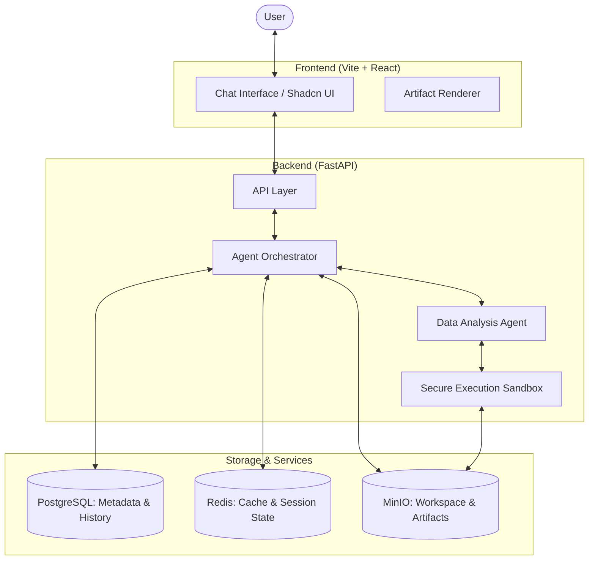
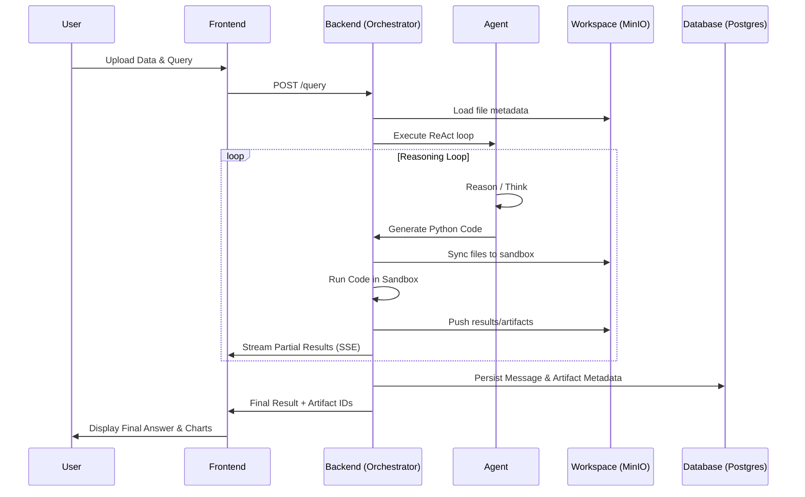

# CodingAgent: AI-Powered Data Analysis & Coding Assistant

[](https://www.python.org/downloads/)
[](https://fastapi.tiangolo.com/)
[](https://reactjs.org/)
[](https://opensource.org/licenses/MIT)

**CodingAgent** is a stateful, AI-driven platform designed for automated data cleaning, analysis, and visualization. By combining the power of Large Language Models (LLMs) with a secure Python execution environment, it allows users to upload datasets and perform complex data tasks through natural language.

---

## 🏗️ Architecture Overview

The system is built on a modular, event-driven architecture that ensures secure code execution and persistent session state.



## ✨ Key Features

- **Automated Data Analysis**: Upload CSV/Excel files and perform analysis via natural language queries.
- **Secure Code Execution**: AI-generated Python code runs in a sandboxed environment to ensure system safety.
- **Stateful Sessions**: Persistent chat history and workspace files across sessions using PostgreSQL and MinIO.
- **Real-time Streaming**: Live feedback of the agent's "thinking" process and code execution progress via Server-Sent Events (SSE).
- **Interactive Artifacts**: Dynamically rendered charts (Plotly), tables, and logs.
- **Self-Correction**: The agent automatically attempts to fix its own code if errors occur during execution.

## 🛠️ Tech Stack

| Layer | Technologies |
| --- | --- |
| **Frontend** | React 19, Vite, Tailwind CSS, Shadcn UI, Lucide React |
| **Backend** | FastAPI, Pydantic, Uvicorn, LangChain, LiteLLM |
| **Database** | PostgreSQL (Metadata & Chat History) |
| **Cache** | Redis (Session Locking & State) |
| **Storage** | MinIO (Virtual File System / S3-compatible) |
| **Execution** | Python (smolagents / Secure Sandbox) |

## 📂 Project Structure

```text
.
├── backend/                # FastAPI Backend
│   ├── app/                # Application Logic
│   │   ├── agents/         # AI Agent Definitions (Data Analysis, Base)
│   │   ├── api/            # REST API Routes (Query, Upload, Artifacts)
│   │   ├── db/             # Database Connectivity & Repositories
│   │   ├── services/       # Core Business Logic (Orchestrator, Workspace)
│   │   └── shared/         # Shared Models & Utilities
│   └── main.py             # Entry Point
├── frontend/               # Vite + React Frontend
│   ├── src/
│   │   ├── components/     # UI Components (Chat, Artifacts, Layout)
│   │   ├── hooks/          # Custom React Hooks
│   │   ├── api/            # API Client Logic
│   │   └── types/          # TypeScript Definitions
│   └── package.json
├── docker-compose.yml      # Container Orchestration
└── overview.md             # Project Roadmap & Strategic Plan
```

## 🔄 Core Logic Flow

The following diagram illustrates the lifecycle of a user query, from initial request to the final generated artifact.



## 🚀 Installation & Setup

### Prerequisites

- Python 3.11+
- Node.js 18+ & pnpm
- Docker & Docker Compose (for infrastructure)

### 1. Infrastructure Setup

Spin up the required services (Postgres, Redis, MinIO):

```bash
docker-compose up -d
```

### 2. Backend Installation

```bash
cd backend
pip install uv
uv venv
source .venv/bin/activate
uv sync
```

Create a `.env` file in `backend/` using the provided template and add your LLM API keys.

### 3. Frontend Installation

```bash
cd frontend
pnpm install
pnpm dev
```

---

## 📖 Usage Example

1. **Upload**: Drag and drop a `sales_data.csv` into the chat.
2. **Query**: Type "Show me the monthly revenue trend for 2023."
3. **Execute**: The agent will:
    - Load the CSV into a pandas DataFrame.
    - Write Python code to aggregate data.
    - Generate a line chart using Altair.
    - Return the summary and interactive chart.

---

*This README was automatically generated by Antigravity.*
